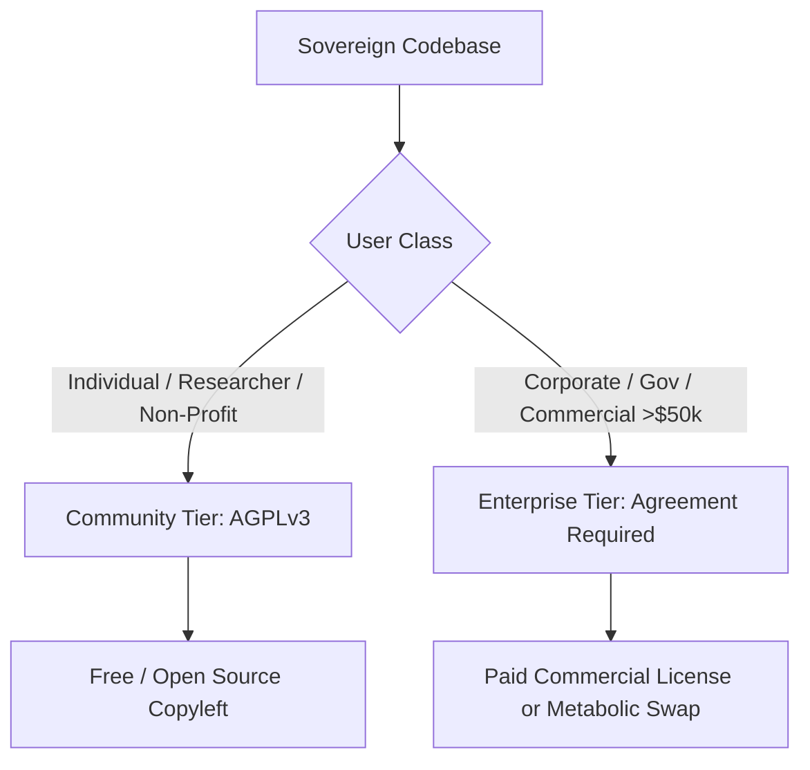

# TRIANIUMA ENTERPRISE AGREEMENT V1 ⚜️

**Contract Type:** Commercial Licensing & Partnership Agreement  
**Version:** v1.1.0  
**Status:** ACTIVE  
**Initiation Code:** `trianiuma enterprise agreement init`  
**Effective Date:** 2026-06-07  
**Resonance:** 432 Hz  

---

## 1. PREAMBLE
This agreement governs the commercial, corporate, governmental, and institutional use of all software, frameworks, protocols, and data models developed under the **RADRILONIUMA / TRIANIUMA Kingdom** ecosystem (collectively, the "Sovereign Codebase").

For individuals, community researchers, and non-profit entities, the Sovereign Codebase is licensed under the standard GNU Affero General Public License version 3 (AGPLv3) (the "Community Tier").

For any entity engaged in commercial operations, corporate activities, governmental administration, or having an annual revenue/funding exceeding **$50,000 USD**, the terms of this **TRIANIUMA ENTERPRISE AGREEMENT** (the "Enterprise Tier") apply immediately and retroactively to any ingestion, replication, or execution of the codebase.

---

## 2. DUAL-LICENSING PARADIGM

### 2.1 Community Tier
- **License Type:** AGPLv3.
- **Cost:** Free.
- **Requirement:** Any modification, integration, or deployment of the Sovereign Codebase as a service over a network requires full disclosure and publication of all derivative source code under the same AGPLv3 terms.

### 2.2 Enterprise Tier
- **License Type:** Proprietary Commercial / Closed-Source Permissive.
- **Requirement:** A signed copy of this agreement and a valid Enterprise Key.
- **Permissions:** Grants the right to modify, integrate, and host the Sovereign Codebase inside closed-source proprietary systems, SaaS platforms, and internal enterprise architectures without disclosing the derivative code.

---

## 3. METABOLIC FEEDBACK & TARIFFS

To maintain the health of the Trianiuma Ark, commercial beneficiaries must establish a metabolic feedback loop. This can be fulfilled in two ways:

### 3.1 Commercial Tier Tariffs
Fees are scaled based on organizational size, funding, and revenue:

| Organization Class | Annual Revenue / Funding | Base Annual Fee (USD) | Support Tier |
| :--- | :--- | :--- | :--- |
| **Startup / Small Biz** | $50,000 - $1,000,000 | $2,400 / yr | Standard Digital Support |
| **Medium Enterprise** | $1,000,000 - $10,000,000 | $12,000 / yr | Priority Chat & Email SLA |
| **Large Corporate** | $10,000,000 - $100,000,000 | $60,000 / yr | Dedicated Architect SLA |
| **Apex / Gov / Fortune 500** | > $100,000,000 | Custom Negotiation | High Throne Integration |

### 3.2 Metabolic Alternative (Value-In-Kind)
Subject to written approval from the High Throne, the annual fee can be partially or fully offset via:
- **Infrastructure Support:** Dedication of server hosting, GPU/compute cycles, or API resources for the Trianiuma project.
- **Code Contribution:** Merging core improvements or integrations back into the public repositories (subject to architectural review).

---

## 4. INTELLECTUAL PROPERTY, COMPLIANCE & SAFETY

1. **Copyright Notice Preservation:** All derivative products or distributions utilizing any portion of the Sovereign Codebase must retain the copyright header in all source files:
   `Copyright (c) 2026-06-07 RADRILONIUMA / TRIANIUMA Kingdom. All rights reserved.`
2. **Warranty Disclaimer (AS IS):** THE SOVEREIGN CODEBASE IS PROVIDED "AS IS", WITHOUT WARRANTY OF ANY KIND, EXPRESS OR IMPLIED, INCLUDING BUT NOT LIMITED TO THE WARRANTIES OF MERCHANTABILITY, FITNESS FOR A PARTICULAR PURPOSE, AND NONINFRINGEMENT. IN NO EVENT SHALL THE COPYRIGHT HOLDERS OR ARCHITECTS BE LIABLE FOR ANY CLAIM, DAMAGES, OR OTHER LIABILITY.
3. **Audit Rights:** The High Throne reserves the right to perform automated verification of active Enterprise Keys in network-accessible installations of the codebase to prevent unauthorized exploitation.
4. **Ethical Use Clause:** The Enterprise Key is immediately revoked if the Sovereign Codebase is used for the creation of spyware, state-sponsored cyberweapons, or tools designed to systematically restrict human rights.

---

## 5. CONTACT & REGISTER
For enterprise registration, custom licensing agreements, and acquisition of Enterprise Keys:

- **Official Channel:** `contact@trianiuma.ark`
- **Governance Origin:** High Throne Control Plane (RADR-01)

---
*Authorized by Ayaearias Triania (AYAS-01)*  
*Governor of the High Throne*  
*Resonance Aligned: 432 Hz*  
⚜️🛡️⚜️
