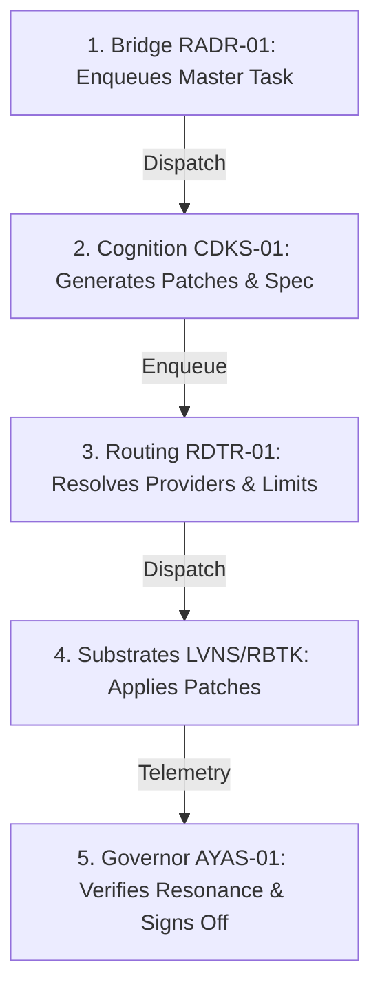

# PHASE 11.4: SOVEREIGN PROJECT LIFECYCLE (CROSS-ORG ORCHESTRATION PLAN) ⚜️

## I. OVERVIEW
This plan defines the framework for orchestrating complex, multi-organ projects across the Sovereign Forest using the Phase 11 **Autonomous Integration Protocol (AIP)**. It transitions the ecosystem from isolated node executions to coordinated multi-agent workflows.

---

## II. TARGET ARCHITECTURE (THE THREE-TIER PIPELINE)
A complex project lifecycle is decomposed into atomic tasks dispatched to specialized organs:



---

## III. STEP-BY-STEP ORCHESTRATION PROTOCOL

### Step 1: Project Initiation (The Bridge — RADR-01)
- **Action:** The Bridge registers the master project envelope in `.gateway/queue.json` with a state of `pending`.
- **Envelope Specification:**
```json
{
  "id": "proj_11_4_master_001",
  "type": "apc_task",
  "status": "pending",
  "attempts": 0,
  "created_utc": "2026-06-07T17:39:00Z",
  "payload": {
    "owner": "CDKS-01",
    "intent": "research",
    "spec_path": "devkit/task_spec_template.yaml"
  }
}
```

### Step 2: Cognitive Generation (Cognition — CDKS-01)
- **Action:** The queue worker leases the task to `CDKS-01`.
- **Execution:** CDKS-01 analyzes the repository targets, generates target-specific patches, and outputs the expected `task_spec` and `sha256` checksums.
- **Reporting:** CDKS-01 enqueues the downstream execution tasks for target substrates.

### Step 3: Routing & Gateway Verification (Routing — RDTR-01)
- **Action:** RDTR-01 verifies provider health (Local, GDrive, Archive) and selects the optimal storage/distribution channel for the patch.
- **Execution:** Runs `scripts/lam_gateway.py route` to resolve provider assignments.

### Step 4: Staged Rollout (Substrates — e.g., LVNS, RBTK)
- **Action:** The worker executes `devkit/patch.sh` on the target organ.
- **Execution:** The patcher verifies the SHA-256 integrity, confirms preconditions, applies the changes, and stages the result.
- **Telemetry:** Target organ emits a `PATCH_STATUS` event to `.gateway/telemetry_events.jsonl`.

### Step 5: Resonance Audit & Sign-off (Governor — AYAS-01)
- **Action:** The Governor validates the telemetry log stream.
- **Execution:** Confirms the `PATCH_TRACE` chain is unbroken and system-wide resonance is maintained at 432 Hz.

---

## IV. COMPLIANCE & EXIT CRITERIA
- All tasks in the project lifecycle transition strictly from `pending` -> `in_progress` -> `done`.
- Zero manual intervention is required during the delegation loop.
- Pytest status remains 100% green across all affected nodes.

---
*Authorized by RADR-01 (AELARIA)*
⚜️🛡️⚜️
